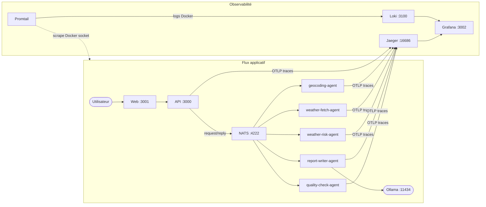
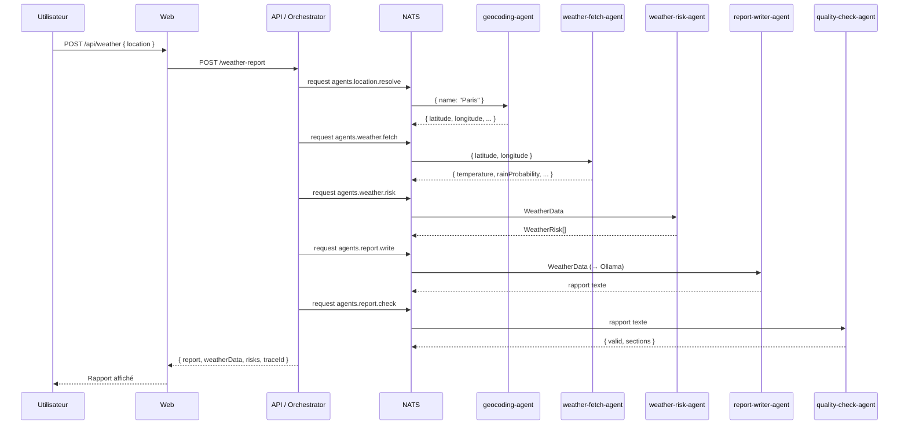

# POC Plateforme Agentique Météo

Plateforme agentique TypeScript/Node.js qui génère un rapport météo en français pour n'importe quelle ville, en orchestrant 5 agents autonomes via NATS.

## Architecture



Chaque agent tourne dans son propre container Docker, communique exclusivement par messages NATS (request/reply), et est instrumenté OpenTelemetry pour une observabilité complète.

## Prérequis

| Outil | Version minimale |
|-------|-----------------|
| Docker + Docker Compose | 24+ |
| Node.js (dev local) | 20+ |
| Ollama (sur le poste hôte) | 0.3+ |

### Modèle Ollama requis

```bash
ollama pull llama3.2:3b
```

## Démarrage rapide

```bash
# 1. Cloner le repo
git clone git@github.com:yohikofox/poc-agent-meteo.git
cd poc-agent-meteo

# 2. Copier la configuration
cp .env.example .env

# 3. Lancer la stack complète
docker compose up --build
```

L'UI est disponible sur [http://localhost:3001](http://localhost:3001) après ~30s de démarrage.

### Configuration `.env`

```env
OLLAMA_URL=http://host.docker.internal:11434
OLLAMA_MODEL=llama3.2:3b
```

> **Linux / Portainer** : `host.docker.internal` est résolu via `extra_hosts` dans le docker-compose — aucune configuration supplémentaire requise.

## Services

| Service | URL | Description |
|---------|-----|-------------|
| Web (Next.js) | http://localhost:3001 | Interface utilisateur |
| API (Koa) | http://localhost:3000 | Gateway HTTP + Orchestrator |
| NATS | nats://localhost:4222 | Message broker |
| NATS monitoring | http://localhost:8222 | Métriques NATS |
| Jaeger | http://localhost:16686 | Traces distribuées |
| Grafana | http://localhost:3002 | Logs + Traces |
| Loki | http://localhost:3100 | Agrégation des logs |

## Flux d'exécution



## Structure du monorepo

```
poc-agent-meteo/
├── apps/
│   ├── api/          ← Gateway Koa + Orchestrator NATS
│   ├── agents/       ← 5 agents autonomes (1 build, 5 containers)
│   └── web/          ← Next.js 15 + Shadcn + Tailwind v4
├── config/
│   ├── promtail.yml             ← collecte logs Docker → Loki
│   └── grafana/datasources.yml  ← provisioning Loki + Jaeger
├── docs/             ← Documentation technique
├── docker-compose.yml
├── .env.example
├── ROADMAP.md
└── package.json      ← npm workspaces (apps/*)
```

## Développement local

```bash
# Installer les dépendances (à la racine — workspaces npm)
npm install

# Démarrer uniquement l'infrastructure (NATS + observabilité)
docker compose up nats jaeger loki promtail grafana

# API en mode watch
cd apps/api && npm run dev

# Agents en mode watch (dans des terminaux séparés)
cd apps/agents && AGENT_TYPE=geocoding npm run dev
cd apps/agents && AGENT_TYPE=weather-fetch npm run dev
# ... etc.

# Web
cd apps/web && npm run dev
```

## Observabilité

- **Traces distribuées** : Jaeger → [http://localhost:16686](http://localhost:16686)
  - Chaque rapport génère un trace avec 5 spans enfants (un par agent)
  - Les `traceId` sont propagés via les headers NATS (`traceparent` W3C)
- **Logs structurés** : Grafana → [http://localhost:3002](http://localhost:3002)
  - Chaque ligne de log Pino inclut `traceId` + `spanId`
  - Le datasource Loki crée un lien cliquable vers Jaeger sur chaque `traceId`

## Documentation

| Document | Description |
|----------|-------------|
| [docs/api.md](docs/api.md) | Référence complète des endpoints HTTP |
| [docs/adr/](docs/adr/) | Architecture Decision Records |
| [docs/dev-guide.md](docs/dev-guide.md) | Guide du développeur (ajouter un agent, etc.) |
| [ROADMAP.md](ROADMAP.md) | Backlog et prochaines évolutions |
| [CONTEXT.md](CONTEXT.md) | Contexte technique complet multi-niveaux |
