# Guide du développeur

Ce guide couvre les tâches de développement courantes : ajouter un agent, modifier un prompt, déboguer des traces, et étendre l'API.

---

## Ajouter un nouvel agent

### 1. Créer le fichier source

```
apps/agents/src/<nom-agent>/index.ts
```

Structure minimale :

```typescript
import "../tracing"; // DOIT être la première ligne — initialise OpenTelemetry

import { connect, StringCodec } from "nats";
import { context, propagation, trace } from "@opentelemetry/api";
import type { MsgHdrs } from "nats";
import { logger, traceCtx } from "../shared/logger";
import type { AgentResponse } from "../shared/types";

const SUBJECT = "agents.mon-sujet.action";

const natsGetter = {
  get: (carrier: MsgHdrs, key: string) => carrier.get(key) || undefined,
  keys: (carrier: MsgHdrs) => [...carrier.keys()],
};

async function main() {
  const nc = await connect({ servers: process.env.NATS_URL ?? "nats://localhost:4222" });
  const sc = StringCodec();
  const tracer = trace.getTracer("mon-agent");
  const sub = nc.subscribe(SUBJECT);

  logger.info({ subject: SUBJECT }, "Agent démarré");

  for await (const msg of sub) {
    // 1. Extraire le contexte de trace W3C depuis les headers NATS
    const parentCtx = msg.headers
      ? propagation.extract(context.active(), msg.headers as MsgHdrs, natsGetter)
      : context.active();

    // 2. Créer un span enfant lié à la trace parente
    await tracer.startActiveSpan("mon-agent.action", {}, parentCtx, async (span) => {
      try {
        const payload = JSON.parse(sc.decode(msg.data));
        logger.info({ ...traceCtx(), payload }, "Message reçu");

        // 3. Logique métier
        const result = await faireLeTravail(payload);

        const response: AgentResponse<typeof result> = { status: "success", output: result };
        msg.respond(sc.encode(JSON.stringify(response)));
        logger.info({ ...traceCtx() }, "Réponse envoyée");
      } catch (err) {
        const reason = err instanceof Error ? err.message : String(err);
        logger.error({ ...traceCtx(), err: reason }, "Erreur agent");
        const response: AgentResponse = { status: "failed", reason };
        msg.respond(sc.encode(JSON.stringify(response)));
        span.recordException(err instanceof Error ? err : new Error(reason));
      } finally {
        span.end();
      }
    });
  }
}

main().catch(console.error);
```

### 2. Enregistrer l'agent dans le registry

Ajouter une entrée dans `apps/api/src/registry/agents.json` :

```json
{
  "id": "mon-agent",
  "name": "Mon Agent",
  "capabilities": ["mon-sujet.action"],
  "natsSubject": "agents.mon-sujet.action",
  "type": "programmatic"
}
```

Types possibles : `"programmatic"` ou `"llm-local"`.

### 3. Appeler l'agent depuis le Supervisor

Dans `apps/api/src/supervisor/WeatherReportSupervisor.ts`, méthode `run()` :

```typescript
const monResult = await this.request<MonType>(
  taskId,
  "mon-agent",
  "Mon Agent",
  "agents.mon-sujet.action",
  { donnees: "en entrée" }
);
if (monResult.status !== "success" || !monResult.output) {
  throw new Error(monResult.reason ?? "Mon agent a échoué");
}
```

### 4. Ajouter le container dans docker-compose

```yaml
agent-mon-agent:
  build:
    context: ./apps/agents
    args:
      AGENT_TYPE: mon-agent        # doit correspondre au dossier src/<nom>/
  image: poc-meteo/agent:mon-agent
  environment:
    NATS_URL: "nats://nats:4222"
    OTEL_SERVICE_NAME: "mon-agent"
    OTEL_EXPORTER_OTLP_ENDPOINT: "http://jaeger:4318"
  depends_on:
    nats:
      condition: service_healthy
  restart: unless-stopped
  networks:
    - poc-meteo
```

> Le `AGENT_TYPE` correspond exactement au nom du dossier dans `apps/agents/src/`.

---

## Modifier le prompt Ollama

Le prompt du `report-writer-agent` est défini dans :

```
apps/agents/src/report-writer/index.ts
```

### Critères du prompt (score 15/15 atteint)

Le prompt doit :
1. Imposer les 4 sections nommées exactement : `Résumé`, `Conditions actuelles`, `Risques`, `Conseils`
2. Interdire explicitement l'utilisation de données non fournies
3. Utiliser `num_predict: 1000` (évite les coupures)
4. Fournir toutes les valeurs numériques dans le texte du prompt

### Variables disponibles dans le prompt

```typescript
const { temperature, rainProbability, wind, humidity } = weatherData;
const { name, country } = weatherData.location;
```

### Tester le prompt en isolation

```bash
curl -X POST http://localhost:11434/api/generate \
  -H "Content-Type: application/json" \
  -d '{
    "model": "llama3.2:3b",
    "prompt": "Votre prompt ici...",
    "stream": false,
    "options": { "num_predict": 1000 }
  }'
```

### Pattern futur : Skills externalisés (roadmap)

La roadmap prévoit d'extraire les prompts dans `skills/<agent>/v1.json` pour les versionner sans redéployer (pattern Semantic Kernel).

---

## Déboguer avec Jaeger

### Accéder aux traces

1. Ouvrir [http://localhost:16686](http://localhost:16686)
2. Sélectionner le service dans le menu déroulant (ex: `api`, `geocoding-agent`)
3. Cliquer sur une trace pour voir le waterfall complet

### Structure d'une trace

```mermaid
gantt
    title Trace d'un rapport météo (exemple)
    dateFormat SSS
    axisFormat %Lms

    section api
    weather-report.run       : 0, 8000
    nats.request location    : 0, 500
    nats.request weather     : 500, 1000
    nats.request risk        : 1000, 1200
    nats.request report      : 1200, 7500
    nats.request quality     : 7500, 8000

    section geocoding-agent
    geocoding.resolve        : 50, 450

    section weather-fetch-agent
    weather.fetch            : 550, 950

    section weather-risk-agent
    weather.risk             : 1050, 1150

    section report-writer-agent
    report.write             : 1250, 7450

    section quality-check-agent
    quality.check            : 7550, 7950
```



### Lien log → trace dans Grafana

Chaque log Pino contient `traceId`. Dans Grafana → Loki, un champ dérivé crée un bouton "Voir dans Jaeger" sur chaque ligne de log.

---

## Déboguer les logs avec Grafana / Loki

1. Ouvrir [http://localhost:3002](http://localhost:3002)
2. Aller dans **Explore** → source **Loki**
3. Quelques requêtes utiles :

```logql
# Tous les logs d'un service
{container=~"poc-agent-meteo.*"} |= "report-writer"

# Logs d'erreur uniquement
{container=~"poc-agent-meteo.*"} | json | level="error"

# Logs d'une trace spécifique
{container=~"poc-agent-meteo.*"} |= "\"traceId\":\"<votre-trace-id>\""
```

---

## Variables d'environnement

### API (`apps/api`)

| Variable | Défaut | Description |
|----------|--------|-------------|
| `PORT` | `3000` | Port HTTP |
| `NATS_URL` | `nats://localhost:4222` | URL du broker NATS |
| `OTEL_SERVICE_NAME` | `api` | Nom du service dans Jaeger |
| `OTEL_EXPORTER_OTLP_ENDPOINT` | `http://jaeger:4318` | Endpoint OTLP |
| `LOG_LEVEL` | `info` | Niveau de log Pino |

### Agents (`apps/agents`)

| Variable | Défaut | Description |
|----------|--------|-------------|
| `NATS_URL` | `nats://localhost:4222` | URL du broker NATS |
| `OTEL_SERVICE_NAME` | `agent` | Nom du service (surchargé par docker-compose) |
| `OTEL_EXPORTER_OTLP_ENDPOINT` | `http://jaeger:4318` | Endpoint OTLP |
| `OLLAMA_URL` | `http://host.docker.internal:11434` | URL Ollama (report-writer uniquement) |
| `OLLAMA_MODEL` | `llama3.2:3b` | Modèle Ollama |

---

## Build Docker en isolation

Chaque agent partage le même `Dockerfile` dans `apps/agents/` :

```bash
# Builder un agent spécifique
docker build \
  --build-arg AGENT_TYPE=geocoding \
  -t poc-meteo/agent:geocoding \
  ./apps/agents

# Lancer en local (NATS doit être démarré)
docker run --rm \
  -e NATS_URL=nats://host.docker.internal:4222 \
  -e OTEL_SERVICE_NAME=geocoding-agent \
  poc-meteo/agent:geocoding
```

---

## Ajouter un endpoint HTTP

Les routes sont dans `apps/api/src/api/routes.ts`. Exemple :

```typescript
router.get("/tasks", (ctx) => {
  ctx.body = taskStore.getAll(); // adapter TaskStore en conséquence
});
```

Penser à mettre à jour `docs/api.md` après l'ajout.
